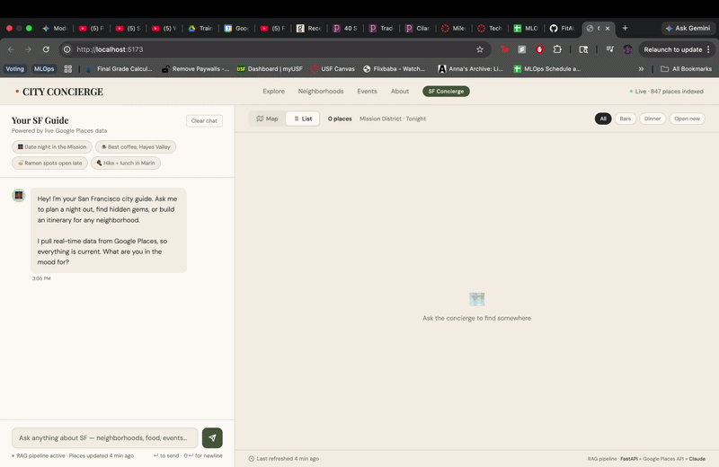

# City Concierge

A RAG-powered SF restaurant concierge built for USF MSDS 603 (MLOps).

FastAPI backend, PostgreSQL + pgvector retrieval, LangChain orchestration, MLflow-driven model selection, deployed to Cloud Run.

## Architecture

```
User Query
    |
    v
FastAPI (/predict)
    |
    v
MLflow Model Registry  -->  Selects LLM config (OpenAI or Gemini)
    |
    v
LangChain RetrievalQA Chain
    |
    +---> PgVectorRetriever (cosine similarity search on Cloud SQL)
    +---> LLM (OpenAI gpt-4o-mini or Gemini 2.5 Flash)
    |
    v
Response + Source Places
```

- **Vector Store**: PostgreSQL 18 + pgvector on Cloud SQL with HNSW cosine index (4,356 SF place embeddings)
- **Embeddings**: OpenAI `text-embedding-3-small` (1536 dims)
- **LLM**: Configurable via MLflow Model Registry — supports OpenAI and Gemini
- **MLflow**: Tracking server on GCE VM `mlflow-server`, reachable privately at `http://10.128.0.2:5000`
- **Container Registry**: GCP Artifact Registry (`us-central1-docker.pkg.dev/mlops-491820/ml-repo/city-concierge`)

## Getting Started

### Prerequisites

- Python 3.10+
- [Poetry](https://python-poetry.org/docs/#installation)
- Docker & Docker Compose (optional, for containerized runs)

### Setup

```bash
# 1. Clone the repo and cd into it

# 2. Create your .env file
cp .env.example .env
# Fill in: DATABASE_URL, OPENAI_API_KEY, GEMINI_API_KEY (optional)

# 3. Install dependencies
poetry install

# 4. Run the app
poetry run uvicorn app.main:app --reload
```

The app reads the `production` alias from the MLflow Model Registry at startup and builds the matching RAG chain.

### Installing Dependencies

| Context | Command | What it installs |
|---|---|---|
| **Local dev / CI** | `poetry install` | App + dev/test tools |
| **App container** | `poetry install --only main` | Production deps only |

## API Endpoints

| Method | Path | Description |
|--------|------|-------------|
| GET | `/root` | Welcome message |
| GET | `/health` | Active model config (provider, model) |
| GET | `/health/db` | Database connectivity check |
| POST | `/predict` | RAG query endpoint |
| GET | `/docs` | Interactive API docs (Swagger) |

### Example Request

```bash
curl -X POST http://localhost:8000/predict \
  -H 'Content-Type: application/json' \
  -d '{"query": "Best tacos in the Mission", "limit": 5}'
```

## Docker

### Build and Run with Docker Compose

```bash
make dev          # Build and start (app + local Postgres)
make dev-detached # Start in background
make down         # Stop all containers
```

Docker Compose is wired for local development even if `.env` contains production database values:

- The local `db` service always creates/healthchecks database `city_concierge`.
- The app container ignores `.env` `DATABASE_URL` and connects to the Compose database at `db:5432`.
- The app container reaches MLflow at `host.docker.internal:5000` to use the IAP tunnel running on your host.
- If your `.env` was previously pointed at production (`DATABASE_URL=postgresql://...`, `POSTGRES_DB=mlops-city-concierge`), it's safe to leave inside the Compose stack — the `app` service overrides those values. But host-side tooling (tests, `scripts/ingest_places_sf.py`, etc.) reads `.env` directly, so update those values if you run anything outside Compose.

Because the MLflow VM is private-only, open the IAP/SSH tunnel in another terminal before running `make dev` if you need RAG endpoints:

```bash
gcloud compute ssh mlflow-server \
  --project=mlops-491820 \
  --zone=us-central1-a \
  --tunnel-through-iap \
  -- -L 5000:localhost:5000
```

Without the tunnel, the app still boots in **degraded mode**: `/health` returns `{"status": "degraded", "rag_chain": "unavailable"}`, `/predict` returns HTTP 503, and all other endpoints (including `/health/db` and the frontend) work normally.

- http://localhost:8000/root
- http://localhost:8000/health
- http://localhost:8000/health/db
- http://localhost:8000/docs

### Frontend → backend wiring

By default the frontend dev server (http://localhost:5173) talks to the **deployed Cloud Run backend** via `frontend/.env.development`. This means:

- Frontend-only contributors can run `make dev` (or `cd frontend && npm run dev`) and immediately get a working app with real data — no IAP tunnel, no local DB, no GCP setup.
- The local `app` container still runs and is reachable at http://localhost:8000 for direct backend testing (curl, /docs, etc.). It's just not what the browser hits.

To point the frontend at the local backend instead (when iterating on `app/` code):

```bash
echo 'VITE_API_URL=http://localhost:8000' > frontend/.env.development.local
# Restart the frontend dev server to pick it up.
```

`*.local` files are gitignored and override `.env.development`. Delete the file to revert.

Notes:

- The standalone container still needs a reachable Postgres database via `DATABASE_URL`.
- If Postgres is running in Docker Compose, use the `docker compose up --build` workflow instead.

## Cloud SQL

The app and scripts read `DATABASE_URL` if set; otherwise they build the connection string from `POSTGRES_*`. If `CLOUD_SQL_INSTANCE_CONNECTION_NAME` is present, they connect via the Cloud SQL Unix socket path. See `.env.example` for all options.

Production Cloud SQL is private-only:

- Instance: `mlops-491820:us-central1:mlops--city-concierge` (Postgres 18, pgvector 0.8.1)
- Private IP: `10.127.0.3` (no public IPv4)
- VPC `default`, Private Services Access peering `servicenetworking-googleapis-com`

Cloud Run reaches Cloud SQL through the auto-injected socket sidecar via `CLOUD_SQL_INSTANCE_CONNECTION_NAME`. Don't add a plaintext `DATABASE_URL` to the Cloud Run service.

## Deployment

### Live Environment

- **Backend (Cloud Run):** https://city-concierge-api-6amzjx52nq-uc.a.run.app
- **Frontend (Vercel):** see the `frontend/` directory; configure `VITE_API_URL` to the Cloud Run URL above
- **Image registry:** `us-central1-docker.pkg.dev/mlops-491820/ml-repo/city-concierge`
- **Cloud SQL instance:** `mlops-491820:us-central1:mlops--city-concierge` (Postgres 18, pgvector 0.8.1, private IP `10.127.0.3`)
- **Cloud Run egress:** Direct VPC Egress on VPC `default`, subnet `default`, `private-ranges-only`
- **MLflow VM:** `mlflow-server` in `us-central1-a`, internal IP `10.128.0.2`, no external IP
- **MLflow firewall:** `allow-mlflow` allows TCP `5000` only from `10.128.0.0/9`

### CI/CD Pipeline

GitHub Actions handle everything from lint to deploy. Triggers and jobs:

| Workflow | Trigger | Jobs |
|---|---|---|
| `.github/workflows/ci.yml` | Every push + PRs to `main` | Ruff lint (incl. bandit security rules), format check, mypy, pytest with coverage |
| `.github/workflows/docker.yml` | Push to `main`, tags `v*`, manual | Buildx image build, Trivy vulnerability scan, push to Artifact Registry, **auto-deploy to Cloud Run** (on `main` only) |
| `.github/dependabot.yml` | Weekly (Mondays) | PRs for Python, npm, GitHub Actions, and Docker base image updates |

**Auto-deploy behavior:** every merge to `main` rebuilds the image, pushes to Artifact Registry, and rolls the Cloud Run service forward. Existing env vars, secret mounts, and Cloud SQL connections on the service are preserved — the workflow only swaps the image.

### Secrets & Environment Variables

Cloud Run distinguishes between **secrets** (mounted from Secret Manager — `POSTGRES_PASSWORD`, `OPENAI_API_KEY`, `GEMINI_API_KEY`) and **plain env vars** (set on the service — `MLFLOW_TRACKING_URI`, `POSTGRES_DB`, `POSTGRES_USER`, `CLOUD_SQL_INSTANCE_CONNECTION_NAME`). The Vercel frontend uses `VITE_*` vars only — these compile into the JS bundle and are visible in the browser, so never put secrets there.

See `.env.example` for the full list with sample values.

### Manual Operations

The Cloud Run service was created once via `gcloud run deploy` (see git history for the original command). Subsequent deploys are handled by CI.

For ad-hoc local image builds or registry pushes:

```bash
docker build -t city-concierge .
docker run --rm -p 8000:8000 --env-file .env city-concierge

# Push (rarely needed — CI handles this on merge to main):
gcloud auth configure-docker us-central1-docker.pkg.dev
docker tag city-concierge us-central1-docker.pkg.dev/mlops-491820/ml-repo/city-concierge:latest
docker push us-central1-docker.pkg.dev/mlops-491820/ml-repo/city-concierge:latest
```

## MLflow

MLflow runs on the private-only GCE VM `mlflow-server`.

- Cloud Run reaches MLflow at `http://10.128.0.2:5000` through Direct VPC Egress.
- The VM has no external IP. For browser access, open an IAP/SSH tunnel and use the local forwarded port:

```bash
gcloud compute ssh mlflow-server \
  --project=mlops-491820 \
  --zone=us-central1-a \
  --tunnel-through-iap \
  -- -L 5000:localhost:5000
```

Then open http://localhost:5000.

### Logging Experiments

```bash
# Log an OpenAI run with default sample queries
poetry run python scripts/log_model_to_mlflow.py

# Log and register a Gemini-backed config
poetry run python scripts/log_model_to_mlflow.py \
  --llm-provider gemini \
  --chat-model gemini-2.5-flash \
  --k 5 \
  --temperature 0.2 \
  --register-model
```

### Setting the Production Model

1. Run experiments with different configs (see above) and compare in the MLflow UI.
2. Register the best run with `--register-model`.
3. Promote a registered version to the `production` alias:
   ```bash
   make set-production-alias VERSION=42
   ```
4. Restart the app — it loads the `production` alias at startup.

## Common Commands

Run `make help` to see all targets.

## Troubleshooting

**`/predict` returns "I don't know" with no sources.** The local Postgres container is empty by default. Either point the frontend at the deployed Cloud Run backend (default — see `frontend/.env.development`) or seed the local DB with `make ingest-places && make embed-places`.

**App boots in degraded mode (`/health` returns `"status": "degraded"`).** The MLflow registry was unreachable at startup. Open the IAP tunnel (see Docker section) and restart the app container.

**Local dev uses production data.** Older `.env` files may have `DATABASE_URL` or `POSTGRES_DB` pointing at production. Compose overrides these for the `app` service, but host-side tooling (tests, ingest scripts) reads `.env` directly. Update or clear those values before running anything outside Compose.

## App Demo 


